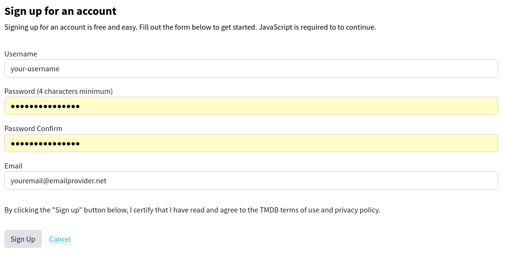
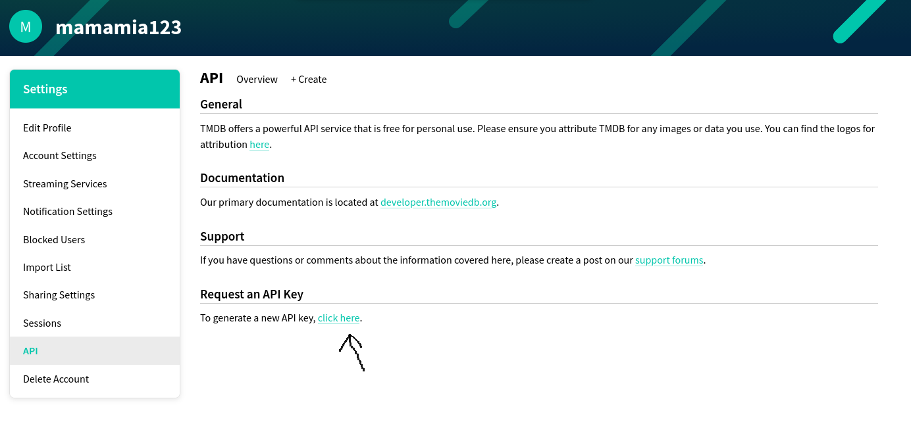
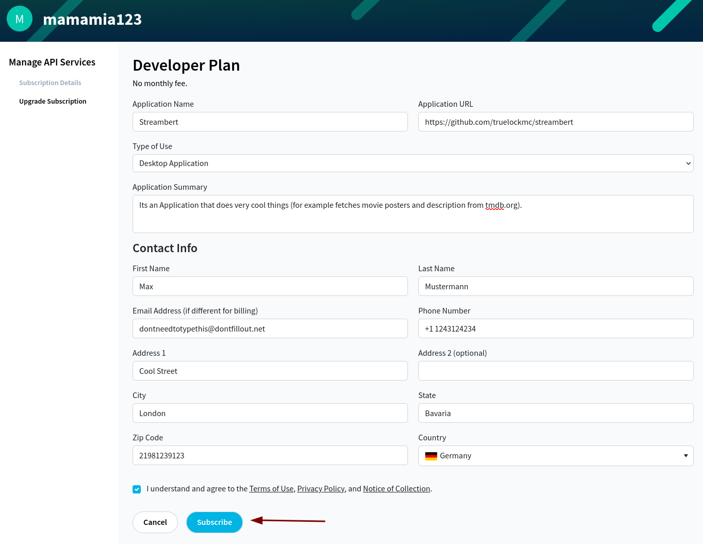
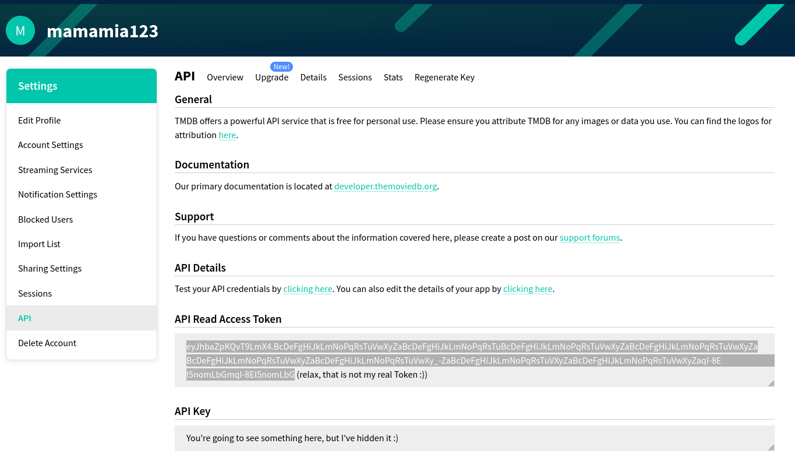
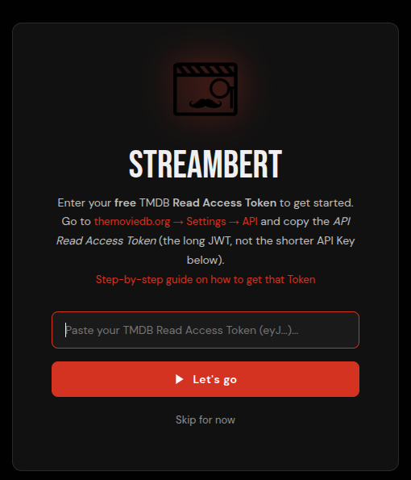

# How to get a TMDB API Token

1. [Login](https://www.themoviedb.org/login) or [register](https://www.themoviedb.org/signup) at themoviedb.org.

2. Open your API Settings: https://www.themoviedb.org/settings/api.
3. Press "click here" to Request an API Key (or go to https://www.themoviedb.org/settings/api/request).

4. Select that you want to use it for "personal use only" and confirm.

5. Fill out every required field (you dont need to put in your real Information 🤫) and press subscribe.

6. Go to https://www.themoviedb.org/settings/api and copy your API Read Access Token.

7. Paste it into Streambert
  

Done, you should be able to fully use streambert now.
  
If this guide is outdated, or you are having any other Problems please report it